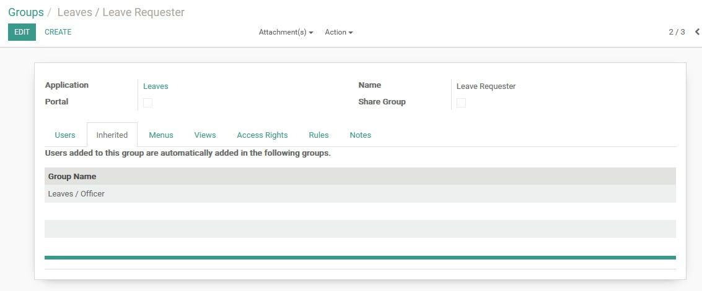
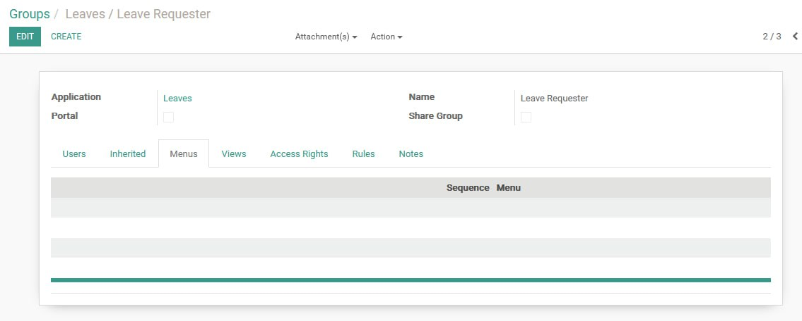
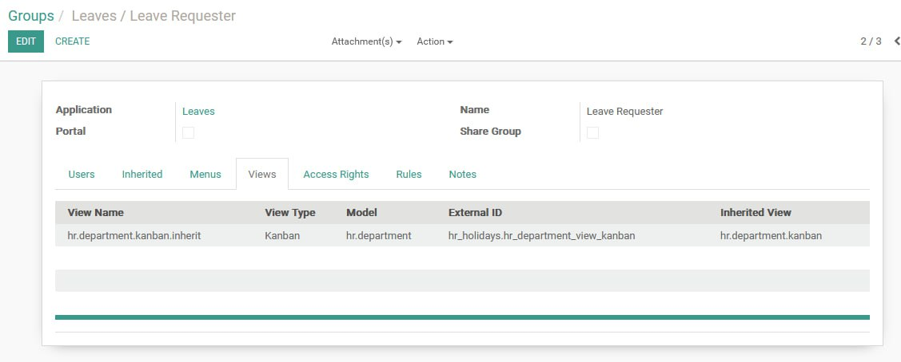
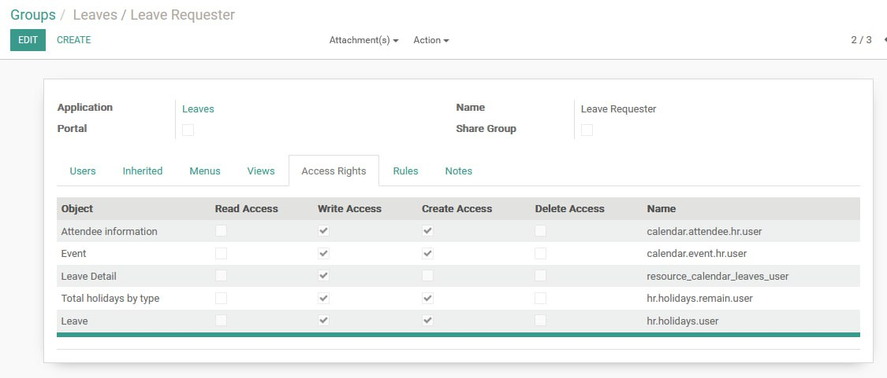
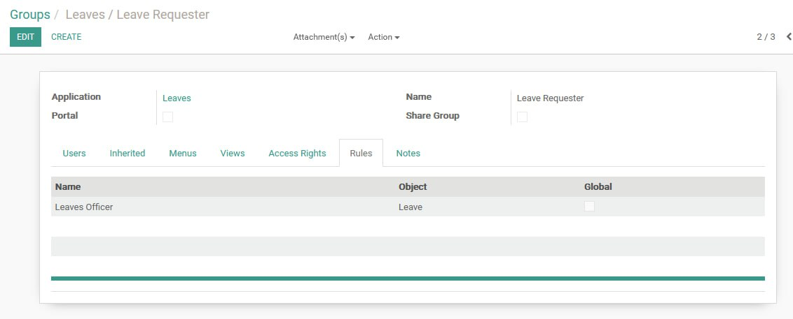
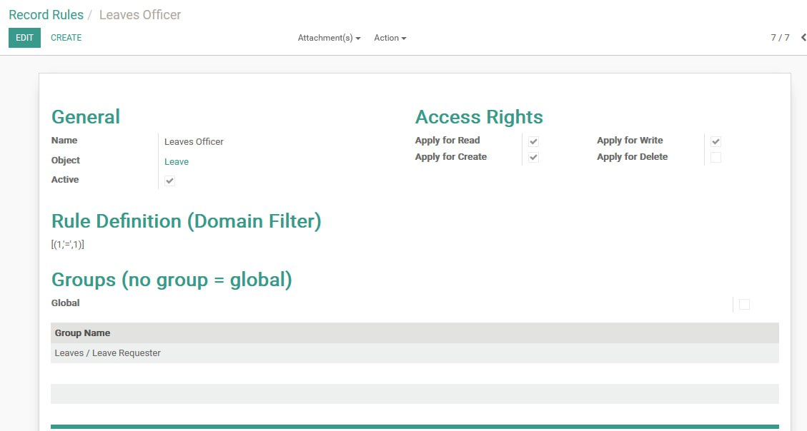

# Odoo 11 HR Customizations

This section covers customizations to the Odoo 11 HR module, including leave request permissions, appraisal access controls, and model adjustments.

---

## Custom Access Rights: Enable Managers to Submit Leave Requests for Themselves and Their Subordinates

- **Issue**: Supervisors or managers need to create and manage leave requests for both themselves and their direct reports, but lack proper access despite being assigned to relevant roles. Default groups do not support delegation without full officer privileges.
- **Solution**: Create a custom group with targeted access rights and record rules to allow controlled leave request creation and management.
  - **Step 1**: Activate **Developer Mode** as Admin.
  - **Step 2**: Go to **Settings > Users & Companies > Groups > Create**.
    - **Application**: _Leaves_
    - **Name**: _Leave Requester_
    - **Users**: Add target supervisors/managers
    - **Inherited Group**: _Leaves / Officer_
    - **Menus**: _Leave empty_
    - **Views**:
      - Add inherited Kanban view:
        - **Name**: `hr.department.kanban.inherit`
        - **Type**: Kanban
        - **Model**: `hr.department`
        - **External ID**: `hr_holidays.hr_department_view_kanban`
        - **Inherited View**: `hr.department.kanban`
    - **Access Rights**:
      - On _Leave_ model: ✅ **Create**, ✅ **Write** (do **not** grant Delete or unrestricted Read)
    - **Record Rules**:
      - Create a new rule under **Settings > Technical > Record Rules**.
      - Search for _"Leaves Officer"_ rule, then edit:
        - **Name**: `Leaves Officer`
        - **Object**: `hr.leave`
        - **Global**: ❌ Unchecked
        - **Domain**: `['|', ('employee_id.user_id', '=', user.id), ('employee_id.parent_id.user_id', '=', user.id)]`
        - Ensures users can manage their own and their subordinates’ leave requests.
  - **Step 3**: Ensure **Related User** is set on HR Employees:
    - Go to **HR > Employees > [Employee] > HR Settings**
    - Set **Related User** to the employee’s own user account if not already linked.
  - **Step 4**: Customize view access in `hr_holidays/views/hr_holidays_views.xml`:
    - Restrict sensitive action buttons to managers only:
      ```xml
      <button string="Confirm" name="action_confirm" states="draft" type="object" class="oe_highlight"/>
      <button string="Approve" name="action_approve" states="confirm" type="object" groups="hr_holidays.group_hr_holidays_manager"/>
      <button string="Validate" name="action_validate" states="validate1" type="object" groups="hr_holidays.group_hr_holidays_manager"/>
      <button string="Refuse" name="action_refuse" states="confirm,validate,validate1" type="object" groups="hr_holidays.group_hr_holidays_manager"/>
      <button string="Reset to Draft" name="action_draft" type="object" attrs="{'invisible': ['|', ('can_reset', '=', False), ('state', 'not in', ['confirm', 'refuse'])]}" groups="hr_holidays.group_hr_holidays_manager"/>
      ```
    - Prevent creation/edit on employee field:
      ```xml
      <field name="employee_id" attrs="{'required': [('holiday_type','=','employee')], 'invisible': [('holiday_type','=','category')]}" groups="hr_holidays.group_hr_holidays_user" options="{'no_create': True, 'no_create_edit': True}"/>
      ```
    - Make department read-only (auto-filled):
      ```xml
      <field name="department_id" attrs="{'readonly': True, 'invisible': [('holiday_type','=','category')]}"/>
      ```
  - **Step 5**: Upgrade the `hr_holidays` module to apply changes.








---

## Restricted Creation and Editing of Leave Types in Leave Request Form

- **Issue**: Users could accidentally create or edit leave types directly from the **Leave Type** dropdown in the leave request form, leading to inconsistent or invalid entries.
- **Solution**: Disable in-line creation and editing options for `holiday_status_id` to enforce use of predefined, centrally managed leave types.
  - Edit `hr_holidays/views/hr_holidays_views.xml`.
  - Locate the `holiday_status_id` field and add restrictions:
    ```xml
    <field name="holiday_status_id"
           context="{'employee_id': employee_id}"
           options="{'no_create': True, 'no_create_edit': True}"/>
    ```
  - This prevents:
    - **Create**: Adding new leave types from the dropdown.
    - **Create and Edit**: Opening the quick edit/create dialog.
  - Proper management of leave types remains available under:
    - **Human Resources > Leaves > Configuration**
  - Restart the Odoo service and upgrade the **Leave Management** (`hr_holidays`) module.
  - After upgrade, only existing leave types can be selected, ensuring data integrity and standardized leave policies.

---
